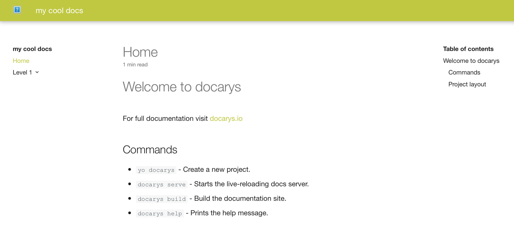

## Commands

Getting started is very simple:

```shell
$ mkdir my-cool-docs
$ cd my-cool-docs/
$ yo docarys
? Your project name my cool docs
   create docarys.yml
   create Dockerfile
   create docs/index.md
   create docs/level 1/index.md
   create .gitignore
```

With this simple command, docarys will create the basic project structure and files.

!!! warning Recommendation
Further improvements to add questions and enable features will be added in the future. This is why we highly recommend to get used to generator-docarys!
!!!

## Project layout

The following project structure will be created in your folder:

    docarys.yml         The configuration file.
    Dockerfile          Docarys ready to use dockerfile.
    docs/
        index.md        The documentation homepage.
        level1/         An example of sub-level
            index.md    Index for the sub-level
        ...             Other markdown pages, images and other files.

## Start working with the documentation

Documentation ready! Time to open it with the browser. Just go to your CMD/Terminal and type:

```shell
$ docarys serve
Building documentation...
Cleaning site directory
Building documentation to directory: '/Users/Sergio/Repositories/docarys/docs/build'
Monitoring changes "/Users/Sergio/Repositories/docarys/docs/docs"
Serving "/Users/Sergio/Repositories/docarys/docs/build" on http://127.0.0.1:5000
Changes detected, building...
Refreshing: '/Users/Sergio/Repositories/docarys/docs/build'
Build succeed
```

A new browser instance will be opened, displaying the documentation:



## IDE

## Docarys command cheetsheet

The following commands will be your day-to-day friends in doarys:

* ```yo docarys``` - Create a new project.
* ```docarys serve``` - Starts the live-reloading docs server.
* ```docarys build``` - Build the documentation site.
* ```docarys help``` - Prints the help message.